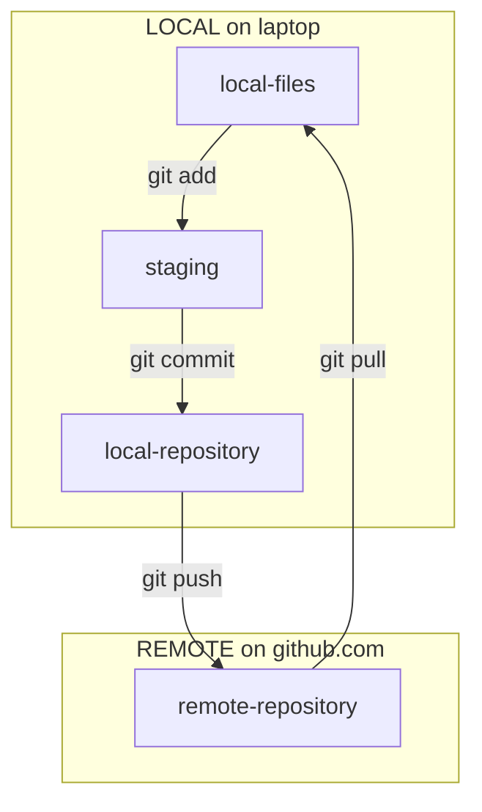

# Working Copy

This is a directory in which I can practice the things I learn by going through the Working Space documentation. This is found [on their webpage](https://workingcopy.app/manual). I'll work on things here and add questions and notes. Then when I'm done I can turn this into a video and put it on YouTube. 

# Chapter One

Create a repository on the github website and then you can download it to the iPad via Working Copy. This is done from the top page by pressing the `+` button and selecting the repository. 

- [] First I need to figure out how I connected Working Copy to my github account. I'm sure there's documentation of that somewhere.
- Create some new files in the remote repository
- Then download them all to the iPad (fetch and merge = pull).

Some important terms: 

- **add**: from the terminal, you add files to a stage using the add command. From there they can be committed to a change that we'll later push from the local repository (on the ipad) to the remote repository (on github.com). 
- **commit**: when you create a new file or add changes to an existing one, these are committed to the remote repository (if created remotely). Locally, I think it works a little bit differently. The files are saved, and then can be added to staging. From staging, they can be committed. That way, multiple files (all the files on the stage) can be committed together. These commits are then pushed and pulled back and forth between the remote and local repository as needed.
- **pull**: getting committed changes from the remote repository (github.com) down to the local repository (ipad)
    - **fetch**: in Working Copy, getting the changes from the remote repository (github.com) from the cloud, but not mixing it in with the local repository.
    - **merge**: mixing in the fetched changes from the remote repository with the local repository (on iPad)
    - a fetch and merge together equals a pull
- **push**: getting committed changes from the local repository (ipad) up to the remote repository (github.com). This is done in Working Copy using the Sync button. Why don't they just call it Push, though the word "sync" is more intuitive, it's not the standard git terminology. 

